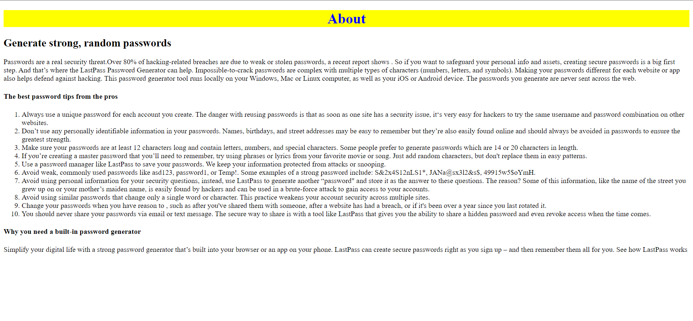

# Password Generator - Django

The goal of this project is to create a random password Generate by using **django**


### Main features

* creates random or customized passwords for users. It helps users create stronger passwords that provide greater security for a given type of access.

* user can select length of password between  6-14

* User can select uppercase , Number , Special Character by enable check Box  according to need

* Where result will appear after triggering the Generate Password Button in following format:


* User can also access information by triggering About Button



## Folder directory of the Project
```              
📦password_generator
 ┣ 📂generator
 ┃ ┣ 📂migrations
 ┃ ┃ ┣ 📂__pycache__
 ┃ ┃ ┃ ┗ 📜__init__.cpython-39.pyc
 ┃ ┃ ┗ 📜__init__.py
 ┃ ┣ 📂templates
 ┃ ┃ ┗ 📂generator
 ┃ ┃ ┃ ┣ 📜about.html
 ┃ ┃ ┃ ┣ 📜home.html
 ┃ ┃ ┃ ┗ 📜password.html
 ┃ ┣ 📂__pycache__
 ┃ ┃ ┣ 📜admin.cpython-39.pyc
 ┃ ┃ ┣ 📜apps.cpython-39.pyc
 ┃ ┃ ┣ 📜models.cpython-39.pyc
 ┃ ┃ ┣ 📜views.cpython-39.pyc
 ┃ ┃ ┗ 📜__init__.cpython-39.pyc
 ┃ ┣ 📜admin.py
 ┃ ┣ 📜apps.py
 ┃ ┣ 📜models.py
 ┃ ┣ 📜tests.py
 ┃ ┣ 📜views.py
 ┃ ┗ 📜__init__.py
 ┣ 📂password_generator
 ┃ ┣ 📂__pycache__
 ┃ ┃ ┣ 📜settings.cpython-39.pyc
 ┃ ┃ ┣ 📜urls.cpython-39.pyc
 ┃ ┃ ┣ 📜wsgi.cpython-39.pyc
 ┃ ┃ ┗ 📜__init__.cpython-39.pyc
 ┃ ┣ 📜asgi.py
 ┃ ┣ 📜settings.py
 ┃ ┣ 📜urls.py
 ┃ ┣ 📜wsgi.py
 ┃ ┗ 📜__init__.py
 ┣ 📂Readme_files
 ┃ ┣ 📜about.png
 ┃ ┣ 📜Home_page.png
 ┃ ┗ 📜output_page.png
 ┣ 📜.gitignore
 ┣ 📜db.sqlite3
 ┣ 📜LICENSE
 ┣ 📜manage.py
 ┗ 📜ReadMe.md
```
Note:- Some of  file are only visible after  applying the migrations
           


## Version(**Used while making project**) 

Python:
     
     Python 3.9.9
     
     
PIP :
   
     pip 21.2.4
     
     
Django:
     
     Django 4.0.1


## Install project dependencies:(**Ignore if you have following dependencies in you computer**)

Python:
     
     https://www.python.org/
     
     
PIP :
   
     python get-pip.py
     
     
Django:
     
     python -m pip install Django

# Password Generator -Django

## Getting Started

First clone the repository from Github and switch to the new directory:

     git clone https://github.com/sa24449/Password_Generator.git
     

Move to Project directory:

     cd Password_Generator
     
    
Then simply apply the migrations:

     python manage.py migrate
    

You can now run the development server:

     python manage.py runserver
     

In Terminal you can find project is running on your local host on successful run  
   
     http://127.0.0.1:8000/
